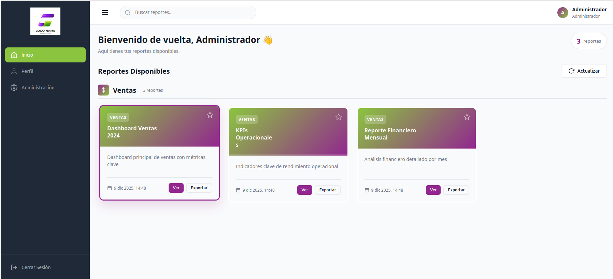
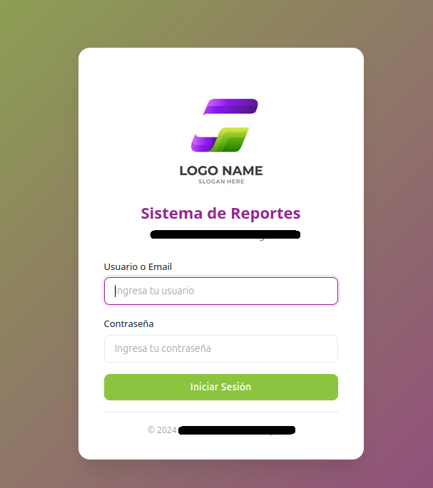
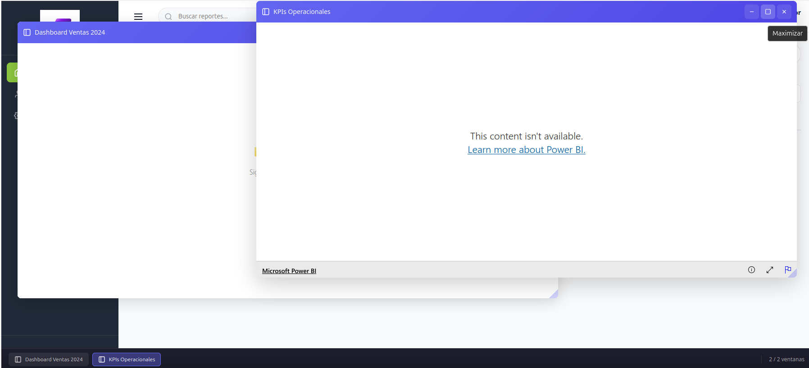

# 📊 Sistema de Gestión de Reportes Power BI (Cualand)

> **Una plataforma centralizada, segura y optimizada para la visualización de dashboards corporativos.**

---

## 🖼️ Vista Previa del Sistema

  
  

    <em>Panel de bienvenida al administrador mostrando los reportes disponibles.</em>
  

---

## 🚀 Acerca del Proyecto

Este sistema resuelve la necesidad de compartir reportes de Power BI de manera segura y profesional, eliminando la dependencia de enlaces dispersos.

Actúa como un contenedor inteligente que autentica a los usuarios y optimiza la visualización. Además, incorpora una lógica de organización dinámica en el panel principal: las tarjetas se agrupan automáticamente por categorías, lo cual facilita al Administrador la auditoría visual y el control granular sobre qué reportes son accesibles para el personal.

### ✨ Características Clave

#### 1. Autenticación Segura y Personalizada
Olvídate de los logins genéricos. El sistema cuenta con su propia puerta de entrada segura con la identidad de marca.

  

#### 2. Visualización Optimizada (Mejora de Ventanas)
Hemos implementado un gestor de ventanas que maximiza el área de visualización del reporte. El contenedor se ajusta dinámicamente, eliminando barras de desplazamiento innecesarias y centrando la atención en los datos de Power BI.

  
  
<em>El marco de aplicación (barra superior morada) integra la carga del reporte de PBI de forma fluida.</em>

#### 3. Gestión de Roles
* **Administradores:** Acceso total a todos los reportes y configuraciones.
* **Usuarios:** Acceso limitado a los reportes asignados a su perfil.

---

## 🛠️ Stack Tecnológico

* **Backend:** Node.js + Express (Rápido y ligero)
* **Base de Datos:** SQLite (Autocontenida, sin configuración de servidor)
* **Frontend Integration:** Power BI Embedded API
* **UI/UX:** HTML5, CSS3 Moderno

---

## 🏁 Despliegue Rápido (Local)

Clona y ejecuta el proyecto en minutos. La base de datos se inicializa sola.

1.  **Instalar dependencias:**
    \`npm install\`

2.  **Iniciar el servidor:**
    \`npm start\`
    *Visita http://localhost:3000*

### �� Credenciales de Prueba (Desarrollo)

El sistema genera estos usuarios automáticamente al iniciar por primera vez:

| Rol | Usuario | Contraseña |
| :--- | :--- | :--- |
| 👑 **Admin** | \`admin\` | \`admin123\` |
| 👤 **Usuario** | \`usuario1\` | \`user123\` |

---

  Desarrollado para <strong>Cualand Flowers & Logistics</strong>
   
  Con ❤️ por <a href="https://github.com/SebasVA1234">SebasVA1234</a>

