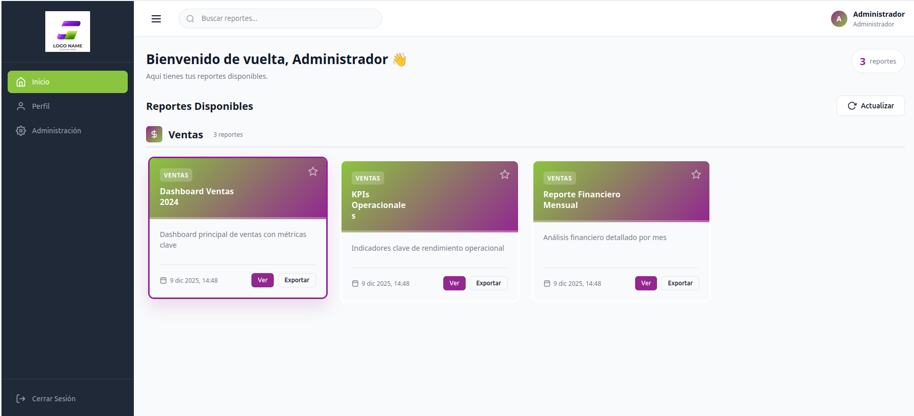

# Internal operations platform

An internal platform for a flower export company: it serves Power BI dashboards to
the people allowed to see them, and around that it runs HR, payroll, document
management and air freight quoting — all behind one authentication and permission
layer.

**136 REST endpoints**, one Node.js service, and a data layer that runs unchanged on
SQLite or PostgreSQL.

<div align="center">
  
  <p><em>Report portal. Cards group themselves by category, and each user only sees what their role and overrides allow.</em></p>
</div>

---

## Why it exists

Sharing corporate dashboards by pasting Power BI links into chats has two problems:
the links leak, and nobody can answer who saw what. This puts the reports behind a
real front door and keeps a record.

Once that door existed, it made sense to put the rest of the company's internal
tooling behind the same one instead of standing up a second system for each need.

## What's inside

| Module | What it does |
|---|---|
| **Reports** | Power BI dashboards embedded in a window manager that maximizes viewing area; grouped by category; per-user assignment |
| **Access control** | Roles, per-user permission overrides, resource-level ACL, and an audit log |
| **HR** | Employees, departments, teams, attendance, holiday calendar, vacation and compensated balances, internal memos with inbox and sent |
| **Payroll** | Payroll runs and parameters, per-employee PDF generation |
| **Documents** | Upload, download, streaming, per-user document matrix |
| **Quoting** | Air freight quotes: airlines, freight forwarders, airports, destinations and tariffs |

## Security

This is the part I'd want reviewed first.

- **Two-factor authentication (TOTP)** with QR enrolment, and a separate attempt
  limit per account before a 15-minute lockout — so 2FA can't be brute-forced even
  when the password is known.
- **JWT that fails closed.** The server refuses to start if the secret is missing, is
  still the example value, or is shorter than 32 characters. A misconfigured deploy
  stops instead of silently accepting forged tokens.
- **No password ever stored in clear.** bcrypt hashing, and a migration that drops a
  legacy `plain_password` column if it is still present.
- **Forced password change on first login**, so a database seeded with a default
  password can't stay that way.
- **In production, test users are not seeded** — and if one survives from an older
  seed, it is deactivated automatically.
- `helmet`, an explicit CORS origin allowlist that warns on startup if left open, and
  global rate limiting.

## Data layer

One interface, two drivers: `better-sqlite3` for a zero-setup local run, `pg` for
production. The schema is maintained for both, and `scripts/migrate-sqlite-to-postgres.js`
moves an existing database across when a deployment outgrows SQLite.

## Running it

```bash
npm install
cp .env.example .env     # JWT_SECRET is mandatory; see the comments in the file
npm start                # http://localhost:3000
```

The database initializes itself on first start. In development it seeds an `admin`
user with a password you must change on first login. Setting `SEED_ADMIN_PASSWORD`
before the first production deploy is mandatory — the file explains why.

There is also a Docker image and a `gateway/` service with its own deployment config.

## Stack

Node.js · Express · JWT · otplib (TOTP) · bcrypt · helmet · better-sqlite3 · PostgreSQL · PDFKit · Multer · Docker

---

<sub>Built for Cualand Flowers & Logistics by <a href="https://github.com/SebasVA1234">Sebastián Vásquez</a></sub>
