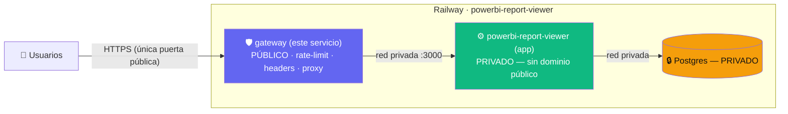

# Gateway de borde — Helper Ecualand (estilo Bifrost)

Única puerta pública del sistema. Hace **reverse proxy** de todo el tráfico al
**backend privado** (la app Express), agregando rate-limit de borde, cabeceras de
seguridad y reenvío de la IP real. El backend queda **sin dominio público**.

## Topología objetivo



## Variables de entorno

| Var | Default | Para qué |
|---|---|---|
| `PORT` | `8080` | puerto del gateway (Railway lo inyecta) |
| `BACKEND_URL` | `http://powerbi-report-viewer.railway.internal:8080` | URL **interna** del backend (puerto = PORT que Railway le asigna a la app, **8080**) |
| `GATEWAY_RATE_MAX` | `1000` | máx requests por ventana (rate-limit de borde) |
| `GATEWAY_RATE_WINDOW_MS` | `900000` | ventana del rate-limit (15 min) |

## Despliegue en Railway (pasos guiados)

> Probamos con **dominio temporal ANTES** del cutover. Rollback siempre listo.

1. **Crear el servicio gateway** en el proyecto `powerbi-report-viewer`:
   `+ New` → `GitHub Repo` → `ecualand-innovacion/powerbi-report-viewer`.
2. En el servicio nuevo → **Settings** → **Source** → **Root Directory** = `gateway`.
   (Así usa `gateway/Dockerfile` y `gateway/railway.toml`.)
3. **Variables** del gateway → `BACKEND_URL` ya viene en el default del código
   (`...railway.internal:8080`); sólo setealo si el puerto/nombre del backend cambia.
4. **Networking** del gateway → **Generate Domain** (dominio TEMPORAL para probar).
5. **Probar** con ese dominio temporal: abrir la app, loguear, navegar. Todo debe
   andar igual (el gateway reenvía al backend, que sigue público en este punto).
6. **CUTOVER** (ventana breve), recién cuando 5) esté ✅:
   a. Backend (`powerbi-report-viewer`) → Networking → **quitar su dominio público**.
   b. Gateway → Networking → asignarle el **dominio de producción** real.
   c. Backend → Variables → `ALLOWED_ORIGINS` = el dominio del gateway.
   d. Verificar (deploy-verifier / health).
7. **Rollback** si algo falla: re-asignar el dominio de producción al backend y
   quitárselo al gateway. Vuelve al estado anterior en segundos.

## Local (smoke)

```bash
cd gateway
npm install
BACKEND_URL=https://powerbi-report-viewer-production.up.railway.app PORT=8090 node server.js
# en otra terminal:
curl localhost:8090/__gateway/health      # {status:ok, role:gateway}
curl localhost:8090/api/health            # proxied → health del backend real
```
